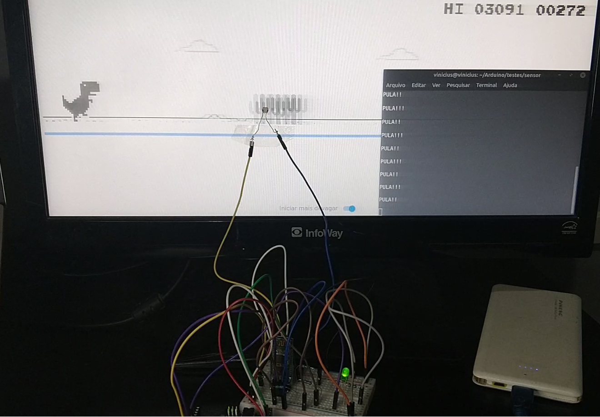

# Utilizando Arduino e comunicação Bluetooth para jogar o jogo do dinossauro do Google

*Projeto feito na Universidade Federal de São Paulo como parte dos requisitos para aprovação na disciplina de Laboratório de Sistemas Computacionais: Comunicação Digital.*

O **relatório** apresenta o desenvolvimento e os resultados obtidos, sendo que esse último pode ser observado, também, no **vídeo**.

